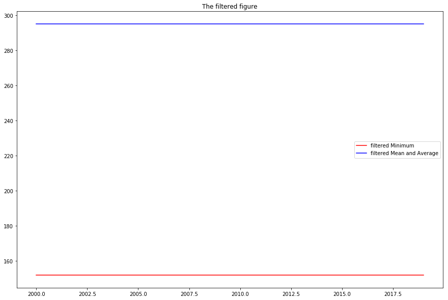

# Unfiltered 

The unfilerted mean and average number is:  264.041666667

The unfiltered minimum number is:  95

# Filtered

The filtered mean and average number after 2000 year is:  295.15

The filtered minimum number after 2000 year is:  152

# Unfiltered Data

{'time': '2019', 'value': '502'}

{'time': '2018', 'value': '482'}

{'time': '2017', 'value': '375'}

{'time': '2016', 'value': '374'}

{'time': '2015', 'value': '365'}

{'time': '2014', 'value': '352'}

{'time': '2013', 'value': '328'}

{'time': '2012', 'value': '312'}

{'time': '2011', 'value': '309'}

{'time': '2010', 'value': '300'}

{'time': '2009', 'value': '298'}

{'time': '2008', 'value': '286'}

{'time': '2007', 'value': '263'}

{'time': '2006', 'value': '235'}

{'time': '2005', 'value': '212'}

{'time': '2004', 'value': '209'}

{'time': '2003', 'value': '200'}

{'time': '2002', 'value': '186'}

{'time': '2001', 'value': '163'}

{'time': '2000', 'value': '152'}

{'time': '1999', 'value': '124'}

{'time': '1998', 'value': '113'}

{'time': '1997', 'value': '102'}

{'time': '1996', 'value': '95'}

# Filtered Data
{'time': '2019', 'value': '502'}

{'time': '2018', 'value': '482'}

{'time': '2017', 'value': '375'}

{'time': '2016', 'value': '374'}

{'time': '2015', 'value': '365'}

{'time': '2014', 'value': '352'}

{'time': '2013', 'value': '328'}

{'time': '2012', 'value': '312'}

{'time': '2011', 'value': '309'}

{'time': '2010', 'value': '300'}

{'time': '2009', 'value': '298'}

{'time': '2008', 'value': '286'}

{'time': '2007', 'value': '263'}

{'time': '2006', 'value': '235'}

{'time': '2005', 'value': '212'}

{'time': '2004', 'value': '209'}

{'time': '2003', 'value': '200'}

{'time': '2002', 'value': '186'}

{'time': '2001', 'value': '163'}

{'time': '2000', 'value': '152'}

# Unfiltered data figure including minimum and average value


# Filtered data figure including minimum and average value


# The main code
```
!python run_classifier.py \
  --task_name=quora \
  --do_train=True \
  --do_eval=True \
  --do_predict=True \
  --data_dir=bert_data/ \
  --vocab_file=gs://cloud-tpu-checkpoints/bert/uncased_L-12_H-768_A-12/vocab.txt \
  --bert_config_file=gs://cloud-tpu-checkpoints/bert/uncased_L-12_H-768_A-12/bert_config.json \
  --init_checkpoint=gs://cloud-tpu-checkpoints/bert/uncased_L-12_H-768_A-12/bert_model.ckpt \
  --max_seq_length=128 \
  --train_batch_size=32 \
  --learning_rate=5e-5 \
  --num_train_epochs=2.0 \
  --output_dir=output 
```
