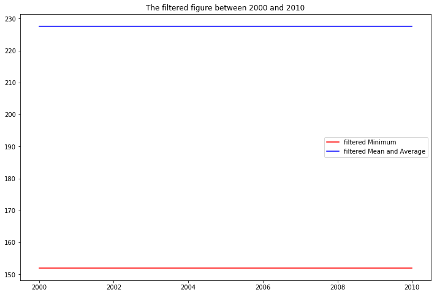

# Unfiltered 

The unfilerted mean and average number is:  264.041666667

The unfiltered minimum number is:  95

# Filtered after 2001 year

The filtered mean and average number after 2001 year is:  227.636363636

The filtered minimum number after 2001 year is:  152

# Filtered between 2000 year and 2010 year

The filtered mean and average number between 2000 year and 2010 year is:  295.15

The filtered minimum number after between 2000 year and 2010 year is:  163

# Unfiltered Data

{'time': '2019', 'value': '502'}

{'time': '2018', 'value': '482'}

{'time': '2017', 'value': '375'}

{'time': '2016', 'value': '374'}

{'time': '2015', 'value': '365'}

{'time': '2014', 'value': '352'}

{'time': '2013', 'value': '328'}

{'time': '2012', 'value': '312'}

{'time': '2011', 'value': '309'}

{'time': '2010', 'value': '300'}

{'time': '2009', 'value': '298'}

{'time': '2008', 'value': '286'}

{'time': '2007', 'value': '263'}

{'time': '2006', 'value': '235'}

{'time': '2005', 'value': '212'}

{'time': '2004', 'value': '209'}

{'time': '2003', 'value': '200'}

{'time': '2002', 'value': '186'}

{'time': '2001', 'value': '163'}

{'time': '2000', 'value': '152'}

{'time': '1999', 'value': '124'}

{'time': '1998', 'value': '113'}

{'time': '1997', 'value': '102'}

{'time': '1996', 'value': '95'}

# Filtered Data after 2001 year
{'time': '2019', 'value': '502'}

{'time': '2018', 'value': '482'}

{'time': '2017', 'value': '375'}

{'time': '2016', 'value': '374'}

{'time': '2015', 'value': '365'}

{'time': '2014', 'value': '352'}

{'time': '2013', 'value': '328'}

{'time': '2012', 'value': '312'}

{'time': '2011', 'value': '309'}

{'time': '2010', 'value': '300'}

{'time': '2009', 'value': '298'}

{'time': '2008', 'value': '286'}

{'time': '2007', 'value': '263'}

{'time': '2006', 'value': '235'}

{'time': '2005', 'value': '212'}

{'time': '2004', 'value': '209'}

{'time': '2003', 'value': '200'}

{'time': '2002', 'value': '186'}

{'time': '2001', 'value': '163'}

# Filtered Data between 2000 year and 2010 year
{'time': '2010', 'value': '300'}

{'time': '2009', 'value': '298'}

{'time': '2008', 'value': '286'}

{'time': '2007', 'value': '263'}

{'time': '2006', 'value': '235'}

{'time': '2005', 'value': '212'}

{'time': '2004', 'value': '209'}

{'time': '2003', 'value': '200'}

{'time': '2002', 'value': '186'}

{'time': '2001', 'value': '163'}

{'time': '2000', 'value': '152'}

# Unfiltered data figure including minimum and average value


# Filtered data figure including minimum and average value



# The methods code
```
import matplotlib.pyplot as plt
import numpy as np


#########begin load json file and transfer the string value into the int value################
def json_string2int(example_dict):
    # Print the json file to check the value
    for example in example_dict:
        print (example)
    
    # Convert the string format of the value into the int format from the json dictionary
    example_value_list = []
    for example in example_dict:
        example_value_list.append(int(example['value']))
    
    # Convert the string format of the time into the int format from the json dictionary    
    example_time_list = []
    for example in example_dict:
        example_time_list.append(int(example['time']))
    
    return example_value_list, example_time_list
#########end load json file and transfer the string value into the int value################

##########################Begin Unfiltered Processing################################
def unfilter_processing(example_dict):
    # Calculate the unfiltered mean and average number of the value
    example_value_list, example_time_list = json_string2int(example_dict)
    # Make a copy of the json dictionary    
    example_dict_copy = example_dict.copy()
    example_dict_copy_mean = np.mean(example_value_list)
    print ("The unfilerted mean and average number is: ",example_dict_copy_mean)
    
    # Calculate the unfiltered minimum number of the value
    example_dict_copy_minimum = np.amin(example_value_list)
    print ("The unfiltered minimum number is: ",example_dict_copy_minimum)
    
    # Append the unfiltered mean and average number into a list
    example_dict_copy_mean_list = []
    for i in range(len(example_dict_copy)):
        example_dict_copy_mean_list.append(example_dict_copy_mean)
    
    # Append the unfiltered minimum number into a list
    example_dict_copy_minimum_list = []
    for i in range(len(example_dict_copy)):
        example_dict_copy_minimum_list.append(example_dict_copy_minimum)
        
    #Output the unfiltered figure
    draw_figure(12,8,'The unfiltered figure',example_time_list,example_dict_copy_minimum_list, example_dict_copy_mean_list,'r','b',"Unfiltered Minimum","Unfiltered Mean and Average",'best')

##########################End Unfiltered Processing################################

##########################Begin filtered Processing with begin and end year ################################
# The filter condition is to filter out the mean and average and minimum number between the begin year and the end year. 
def filter_processing_begin_end(example_dict, begin_year, end_year):
    example_value_list, example_time_list = json_string2int(example_dict)
    # Pick the value after begin_year
    example_value_list_filtered = []
    for example in example_dict:
        if int(example["time"]) > begin_year or int(example["time"]) == begin_year and int(example["time"]) < end_year or int(example["time"]) == end_year:
            example_value_list_filtered.append(int(example['value']))
            print (example['value'])
    
    # Pick the time after begin_year
    example_time_list_filtered = []
    for example in example_time_list:
        if example > begin_year or example == begin_year and example < end_year or example == end_year:
            example_time_list_filtered.append(example)
            print (example)
    
    # Calculate the filtered mean and average number of the value
    example_dict_copy_mean = np.mean(example_value_list_filtered)
    print ("The filtered mean and average number between "+str(begin_year)+ " and " +str(end_year)+ " is: ",example_dict_copy_mean)
    
    # Calculate the filtered minimum number of the value
    example_dict_copy_minimum = np.amin(example_value_list_filtered)
    print ("The filtered minimum number between "+str(begin_year)+ " and " +str(end_year)+ " is: ",example_dict_copy_minimum)
    
    # Append the filtered mean and average number into a list
    example_dict_copy_mean_list = []
    for i in range(len(example_value_list_filtered)):
        example_dict_copy_mean_list.append(example_dict_copy_mean)
    
    # Append the filtered minimum number into a list
    example_dict_copy_minimum_list = []
    for i in range(len(example_time_list_filtered)):
        example_dict_copy_minimum_list.append(example_dict_copy_minimum)
        
    #Output the filtered figure
    draw_figure(12,8,'The filtered figure between '+str(begin_year)+' and '+str(end_year),example_time_list_filtered,example_dict_copy_minimum_list, example_dict_copy_mean_list,'r','b',"filtered Minimum","filtered Mean and Average",'best')
  
##########################End filtered Processing with begin and end year ################################

##########################Begin filtered Processing with only begin year ################################

#The filter condition is to filter out the mean and average and minimum number after the begin year.
def filter_processing_begin(example_dict, begin_year):
    example_value_list, example_time_list = json_string2int(example_dict)
    # Pick the value after begin_year
    example_value_list_filtered = []
    for example in example_dict:
        if int(example["time"]) > begin_year or int(example["time"]) == begin_year:
            example_value_list_filtered.append(int(example['value']))
            print (example['value'])
    
    # Pick the time after begin_year
    example_time_list_filtered = []
    for example in example_time_list:
        if example > begin_year or example == begin_year:
            example_time_list_filtered.append(example)
            print (example)
    
    # Calculate the filtered mean and average number of the value
    example_dict_copy_mean = np.mean(example_value_list_filtered)
    print ("The filtered mean and average number after "+ str(begin_year)+ " year is: ",example_dict_copy_mean)
    
    # Calculate the filtered minimum number of the value
    example_dict_copy_minimum = np.amin(example_value_list_filtered)
    print ("The filtered minimum number after "+ str(begin_year)+ " year is: ",example_dict_copy_minimum)
    
    # Append the filtered mean and average number into a list
    example_dict_copy_mean_list = []
    for i in range(len(example_value_list_filtered)):
        example_dict_copy_mean_list.append(example_dict_copy_mean)
    
    # Append the filtered minimum number into a list
    example_dict_copy_minimum_list = []
    for i in range(len(example_time_list_filtered)):
        example_dict_copy_minimum_list.append(example_dict_copy_minimum)
        
    #Output the filtered figure
    draw_figure(12,8,'The filtered figure after '+str(begin_year),example_time_list_filtered,example_dict_copy_minimum_list, example_dict_copy_mean_list,'r','b',"filtered Minimum","filtered Mean and Average",'best')

##########################End filtered Processing with only begin year ################################
    
########Draw plot program##############
def draw_figure(x,y,title,example_time_list_filtered, example_dict_copy_minimum_list, example_dict_copy_mean_list, color_mini, color_mean, label_mini, label_mean, fig_loc):
    #Output the filtered figure
    plt.figure(figsize=(x,y))
    plt.title(title)
    plt.plot(example_time_list_filtered,example_dict_copy_minimum_list, c=color_mini, label=label_mini)
    plt.plot(example_time_list_filtered,example_dict_copy_mean_list, c=color_mean, label=label_mean)
    plt.legend(loc=fig_loc)
    plt.show() 
########Draw plot program##############
```
# The main function code
```
import json
from methods import unfilter_processing, filter_processing_begin_end, filter_processing_begin

if __name__ == '__main__':
    # Load the json file
    with open('work_test.json','r') as f:
        example_dict = json.load(f)

    # Print the unfilter result
    unfilter_processing(example_dict)
    
    # Print the filter result with begin and end year
    begin_year=2000
    end_year=2010
    filter_processing_begin_end(example_dict, begin_year, end_year)
    
    # Print the filter result with only begin year
    begin_year=2001
    filter_processing_begin(example_dict, begin_year)
  
```
# The json schema check code
```
import json
from jsonschema import validate

# Load the json file
with open('work_test.json','r') as f:
    example_dict = json.load(f)
schema = {
        "type" : "object",
        "properties" : {
                "value" : {"type" : "number"},
                "time" : {"type" : "number"},
                },
        }

for example in example_dict:
    validate(instance=example, schema=schema)

```
